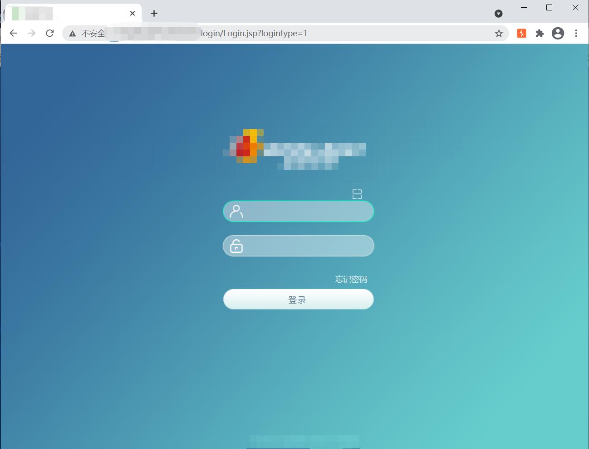
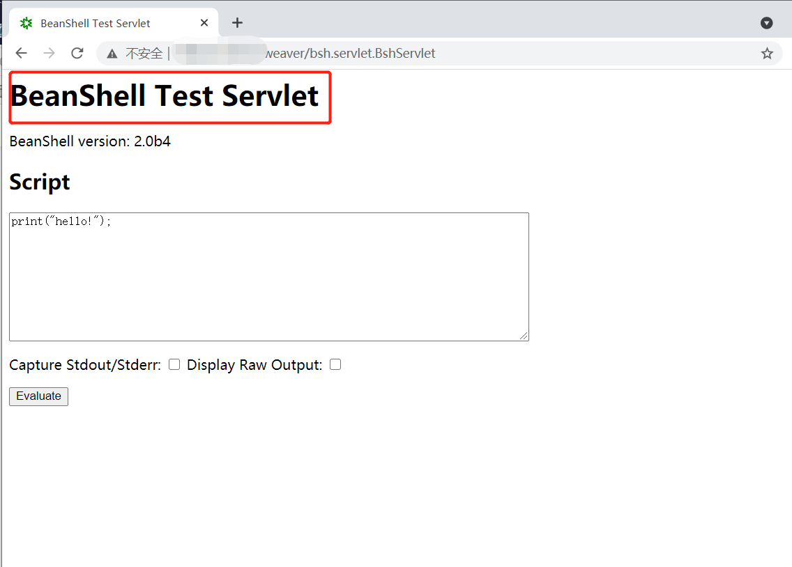
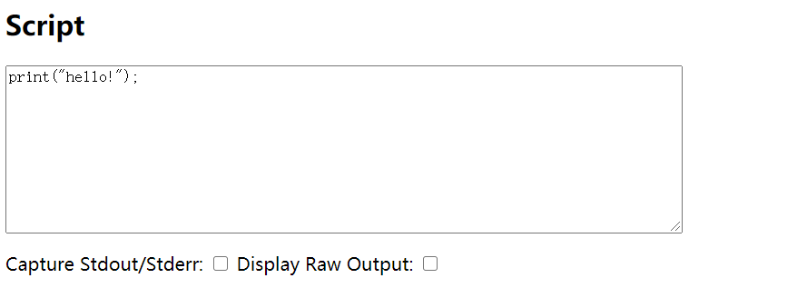

# 影响范围：
泛微OA<=9.0
# FoFa Dork
"Set-Cookie: ecology_JSessionId"
# 漏洞复现：
登录页面：

访问漏洞地址
```/weaver/bsh.servlet.BshServlet```  

将```print```替换为```exec('command')```,evaluate。

返回结果：  
 
使用脚本批量验证：    
  